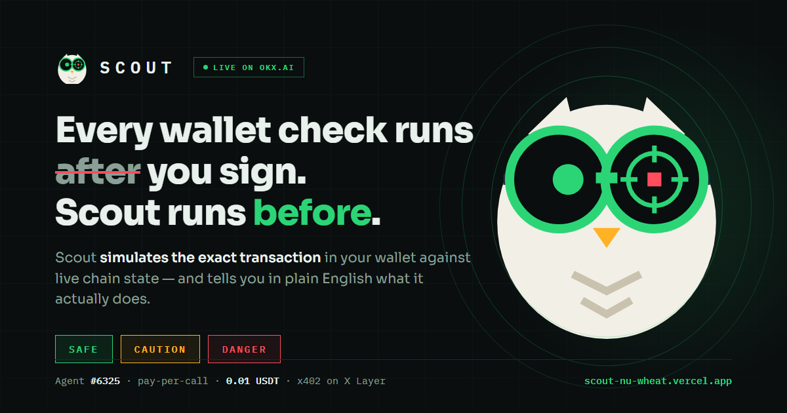
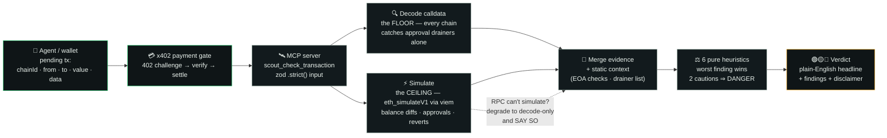
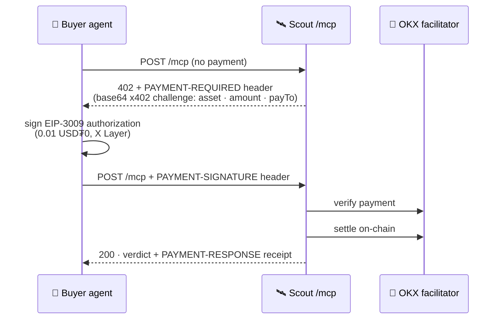

<div align="center">



<br>

[](https://www.okx.ai/agents/6325)
[](https://scout-nu-wheat.vercel.app)
[](https://web3.okx.com/onchainos/dev-docs)


**Every wallet check runs *after* you sign. Scout runs *before*.**

</div>

---

Scout is a pay-per-call [MCP](https://modelcontextprotocol.io) agent service on
[OKX.AI](https://www.okx.ai/agents/6325). You give it the **exact transaction sitting in a
wallet** — `chainId`, `from`, `to`, `value`, `data` — before anyone signs it. Scout executes
it against live chain state and answers in plain English:

<div align="center">

🟢 **SAFE** &nbsp;·&nbsp; 🟡 **CAUTION** &nbsp;·&nbsp; 🔴 **DANGER**

*"STOP — this hands a stranger the keys to ALL of your tokens."*

</div>

Every other on-chain security tool scans tokens, addresses, or approvals that **already
exist**. Scout inspects the **pending transaction itself** — the one moment a check can
actually save the wallet. The signer today is increasingly an AI agent with no popup to
read: Scout is the safety check an agent calls as a tool, in-line, right before it signs.

## What Scout catches

One tool: **`scout_check_transaction`**. It observes what the transaction *actually does* —
balance changes, approvals granted, reverts — then runs six checks on the evidence:

| Check | What it means | Verdict |
|---|---|:---:|
| `KNOWN_DRAINER` | An address in the transaction is on a public drainer blacklist (ScamSniffer) | 🔴 DANGER |
| `UNLIMITED_APPROVAL` | A spender could move an **unlimited** amount of your tokens, forever | 🔴 DANGER |
| `NFT_BLANKET_APPROVAL` | `setApprovalForAll` — every NFT you own in the collection, plus future ones | 🔴 DANGER |
| `APPROVAL_TO_EOA` | The approval goes to a **personal wallet**, not a contract. Real apps never need this | 🔴 DANGER |
| `TX_REVERTS` | The transaction fails when simulated — you'd pay gas for nothing | 🟡 CAUTION |
| `NO_INCOMING_VALUE` | Value leaves your wallet and **nothing comes back** | 🟡 CAUTION |

The worst finding wins; two CAUTIONs escalate to DANGER. Honest transactions pass **SAFE** —
a safety tool that cries wolf on normal behaviour is one users learn to ignore.

> 🎮 **Try it live** — the landing page runs the real engine on four showcase transactions:
> a wallet drainer, an NFT trap, a hidden transfer, and a normal send.
> **[scout-nu-wheat.vercel.app](https://scout-nu-wheat.vercel.app)**

## Architecture

Heuristics are small pure functions — no I/O inside them. Static context is fetched at the
edge and passed in. Effects live at the edges.



**Two analysis modes, honestly labeled.** Decode is the floor: it works on every chain and
catches approval drainers on its own (X Layer runs decode-only — no public RPC there
supports `eth_simulateV1`). Simulation is the ceiling: on Ethereum, Scout executes the
transaction via `eth_simulateV1` state-override and *observes* balance diffs and reverts.
If simulation is unavailable, Scout degrades to decode-only and **says so** in
`analysis.mode` — it never dresses a weaker answer up as a full one.

## Pay-per-call: x402 on X Layer

No accounts, no subscriptions, no API keys for callers. Payment is one HTTP round trip:



The gate runs **before** any validation or simulation compute, and fails closed: a bad
payment gets a clean 402 with a fresh challenge, never a free ride.

## Example — a real captured response

A "claim"-shaped calldata that quietly `transfer()`s 25,000 USDC out of the wallet:

```jsonc
{
  "verdict": "CAUTION",
  "headline": "Money leaves your wallet and nothing comes back.",
  "effects": ["You send 25000 0xa0b8…eb48"],
  "findings": [
    {
      "id": "NO_INCOMING_VALUE",
      "severity": "caution",
      // token = USDC
      "detail": "25000 0xa0b86991c6218b36c1d19d4a2e9eb0ce3606eb48 leaves your wallet and nothing comes back. If you expected a swap or a purchase, this is not one."
    }
  ],
  "analysis": {
    "mode": "simulated",
    "note": "Transaction was decoded and executed against live chain state. Balance changes and revert status are observed, not guessed."
  },
  "simulation": { "success": true, "balanceDiffs": [/* … */], "approvalDiffs": [] },
  "chain": { "id": 1, "name": "Ethereum" },
  "disclaimer": "Safety signal, not a guarantee. Scout simulates the transaction you gave it and reports what it observed. Not financial advice."
}
```

### Tool input

| Field | Type | |
|---|---|---|
| `chainId` | `number` | `196` X Layer · `1` Ethereum |
| `from` | `0x…` address | the wallet that would sign |
| `to` | `0x…` address | the contract or wallet being called |
| `value` | decimal wei string | optional |
| `data` | `0x…` hex calldata | optional |

## Security & privacy, by contract

These are hard rules of the codebase (see [`CLAUDE.md`](CLAUDE.md)), not aspirations:

- 🔑 **Never signs. No private keys anywhere.** Scout only ever *reads* and *simulates*.
- 🗄️ **Stateless.** No database. Nothing about a check persists after the response is sent.
- 🕵️ **Calldata never leaves.** Outbound requests go only to the env-allowlisted RPCs —
  no third-party scanner APIs that would leak what you're about to sign.
- 🧹 **Logs are sanitized.** Never raw calldata, full addresses, payment identifiers, or
  env values — only timestamp, chainId, tool, verdict, latency, finding IDs.
- 🧱 **Strict input.** Every tool schema is zod `.strict()` — unknown fields rejected.
  Error messages never echo raw user input.

## Run it yourself

```bash
git clone https://github.com/zaxcoraider/scout && cd scout
npm ci
cp .env.example .env       # RPC allowlist + pricing; payment creds optional for local dev
npm run dev                # Fastify on :8787 — /mcp (x402-gated) + /healthz
npm test                   # 38 tests: heuristics fixtures + payment gate
```

The camera-ready demo (four acts: live 402 paywall → DANGER → CAUTION → SAFE, ~60s):

```bash
npx tsx --env-file=.env scripts/demo.ts
```

### Repository layout

```
api/            Vercel functions: mcp (paid), demo (free showcase), healthz
src/
  check.ts      the pipeline: decode → simulate → context → heuristics → verdict
  decode/       calldata decoding — approvals caught on every chain
  sim/          eth_simulateV1 state-override simulation (viem simulateCalls)
  heuristics/   six pure functions, no I/O
  verdict/      worst-finding-wins composition
  payment/      x402 gate + OKX facilitator (verify/settle)
  chains/       chain config + RPC allowlist
public/         landing page with the live 4-scenario demo
tests/          fixture tests — every heuristic: positive, negative, edge
```

---

<div align="center">


**Scout** · Agent [#6325](https://www.okx.ai/agents/6325) on OKX.AI · Software Services

*Safety signal, not a guarantee. Scout simulates the transaction you gave it and reports
what it observed. Not financial advice.*
</div>
